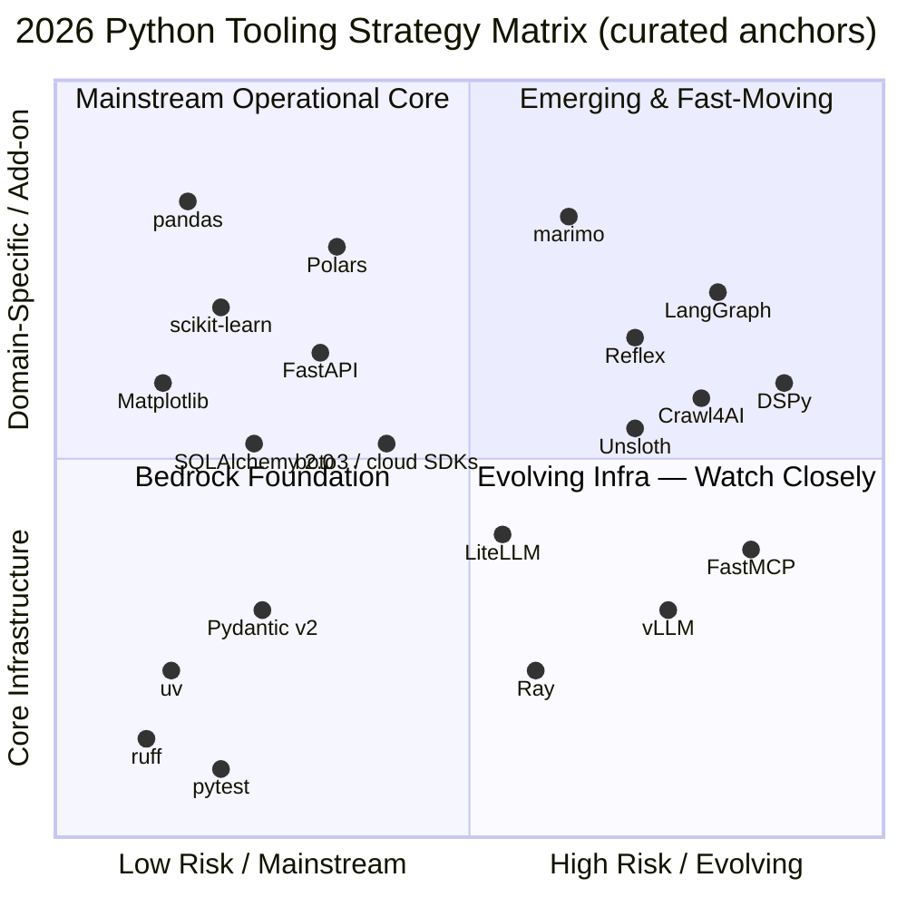
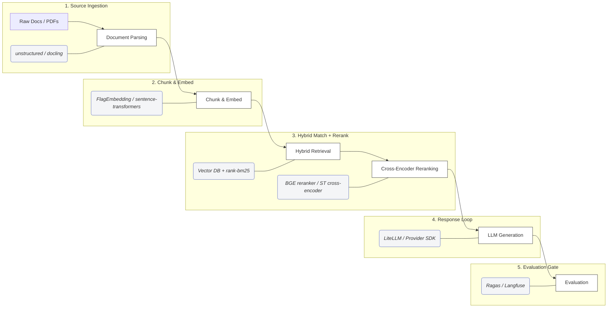
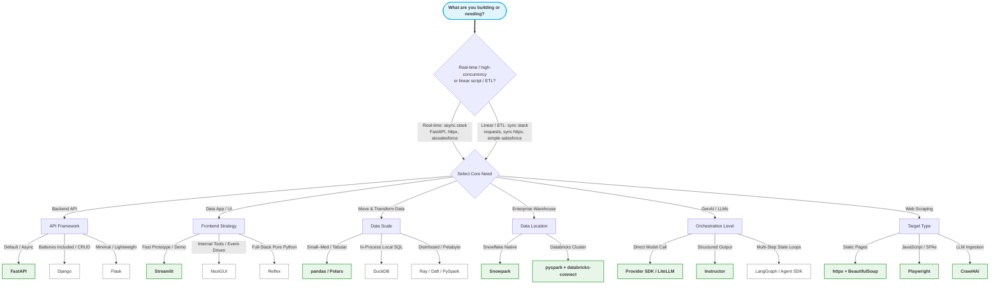

# Python Ecosystem Map 2026: A Practical Guide for Data, Backend, Enterprise Integration, and GenAI Engineers

*An opinionated 2026 map organized by SDLC / use case, with a "reach for it when…" note per
tool, maturity caveats for fast-moving areas, starter stacks, and a decision tree.*

## Introduction — why this exists

Python has quietly become the default language for three very different audiences at once:
people building personal projects and weekend hacks, "vibe coders" scaffolding whole apps
through AI assistants, and enterprises running serious production systems. That breadth is a
strength, but it has a cost — the ecosystem is enormous and it moves fast. A library that was
the obvious choice a few years ago (`requests`, `pip` + `virtualenv`, Flask templates, plain
`pandas` for everything) may no longer be the best default in 2026, even when it still works.

This guide is an attempt to reflect on what's actually relevant now and what has quietly been
superseded. It started as a personal exercise — mapping the tools worth reaching for and tagging
which are stable bedrock versus fast-moving bets — and it seemed worth sharing, because everyone
in the ecosystem is making the same decisions over and over.

It's meant to be useful in two concrete ways:

1. **Faster, better decisions.** Instead of re-litigating "which library for X" every time, scan
   the relevant section, note the maturity tag, and pick a sensible default.
2. **Better prompts for AI tools.** When you scaffold or vibe-code, naming the library steers the
   output: *"build the visualization with Plotly Express," "use `httpx`, not `requests`," "put the
   retries behind `tenacity`."* And it works in reverse — when an AI tool reaches for a default,
   you can push back with specifics: *"why pandas here when Polars would scale better?"* or *"why
   LangChain for a single provider call?"* Precise defaults beat vague prompts, and this map gives
   you the defaults (plus the reasons behind them).

> **This is not an exhaustive catalog** — it's an opinionated map of tools worth knowing, with
> maturity caveats for fast-moving areas. Treat *emerging* and *experimental* tags as "pin your
> versions and read the changelog."

> **Maturity tags** — untagged = **stable / mainstream default**. Tags flag the rest:
> *opinionated* (production-ready but strongly opinionated), *emerging* (real traction, still
> moving fast — pin versions, read changelogs), *experimental* (early/niche), *vendor*
> (tied to one platform). Fast-moving LLM/MCP tooling is tagged so you can tell it apart from
> bedrock like pandas, pytest, and SQLAlchemy.

> **Python versions (2026):** **3.12 / 3.13** are the safer enterprise defaults. **3.14**
> (released Oct 7, 2025) is the current stable feature release — adopt it for new projects once
> your dependency stack has wheels/support (enterprise stacks often lag on library wheels, base
> images, and scanners). **Avoid 3.9** — it reached end of life on Oct 31, 2025. Libraries
> following SPEC 0 often drop Python versions ~3 years after their initial release, which keeps
> many scientific-Python projects near the newest few minor versions. Note some enterprise
> distros (RHEL 9, Amazon Linux 2023) still ship 3.9 as the system interpreter — use a
> `uv`-managed interpreter rather than the system one.

---

## Tooling strategy matrix

Two axes that matter more than a flat "top libraries" list: **operational risk** (how settled vs.
fast-moving) and **necessity** (core infrastructure vs. domain-specific add-on).

**How to read it:** this is a *curated sample of ~20 general-purpose anchors*, not the full
catalog — one or two exemplars per domain family (dev tooling, data, backend, ML, viz, cloud,
GenAI), chosen to show the *shape* of the ecosystem. **Vendor-locked platform SDKs**
(Snowflake/Databricks/Salesforce) are deliberately omitted: their real trade-off is *platform
commitment*, not library maturity, and they live in their own sections. Positions track the
guide's maturity tags — bedrock sits **bottom-left**; fast-moving GenAI/notebook/UI tooling
clusters **top-right**; and the **bottom-right "evolving infrastructure"** quadrant flags tools
that are becoming load-bearing (LiteLLM, vLLM, Ray, FastMCP) while still moving fast — adopt
those deliberately.

---

## 0. Core dev tooling (the modern baseline)

- **uv** — Rust-based package/venv/project/Python-version manager (pip + venv + pip-tools + poetry + pyenv in one) *(Default for new projects — 10–100x faster installs, incl. installing interpreters)*
- **ruff** — Rust-based linter + formatter *(Every project. Replaces Flake8, isort, Black-style formatting, pyupgrade, and many Pylint-style rules (Pylint still does deeper semantic/design analysis))*
- **mypy / pyright** — Static type checkers *(Catching type errors before runtime; pyright is faster and powers Pylance)*
- **Pydantic v2** — Typed validation & serialization powered by pydantic-core (Rust) *(API schemas, config models, structured LLM outputs, data contracts — the validation backbone of the modern stack)*
- **pre-commit** — Git hook manager *(Enforce ruff/mypy on commit)*
- **loguru / structlog** — Ergonomic + structured logging *(loguru for simplicity, structlog for JSON logs in prod)*

---

## 1. Packaging & publishing

- **pyproject.toml** — The standard project/metadata/build config (PEP 621) *(Every modern project)*
- **uv build / uv publish** — Build + publish wheels/sdists via uv *(Simplest path if you're on uv)*
- **Hatch / hatchling** — Project manager + fast build backend *(hatchling as default backend; Hatch adds env/version management)*
- **PDM** — Standards-first package/project manager *(PEP-621 workflows, alt to poetry/uv)*
- **setuptools** — The venerable build backend *(Legacy projects, C-extension builds)*
- **build** — PEP 517 build frontend (`python -m build`) *(Backend-agnostic builds)*
- **twine** — Upload packages to PyPI *(Publishing when not using `uv publish`)*
- **Private indexes** (Artifactory, AWS CodeArtifact, GCP Artifact Registry, Azure Artifacts, devpi) — Private PyPI-compatible repos *(Enterprise internal package distribution)*

---

## 2. Secrets, config & security

- **pydantic-settings** — Typed config from env/files with validation *(12-factor config without boilerplate)*
- **python-dotenv** — Load `.env` files *(Local dev only — **never** ship `.env` secrets to prod)*
- **keyring** — OS-native credential store access *(Local secrets without plaintext files)*
- **Cloud secret managers** (boto3 `secretsmanager`, google-cloud-secret-manager, azure-keyvault-secrets) — Managed secret storage *(Prod secrets — the right answer for HIPAA/PHI/regulated apps)*
- **bandit** — Static security linter *(CI security gate (insecure patterns))*
- **pip-audit / safety** — Scan dependencies for CVEs *(Every CI pipeline — supply-chain hygiene)*
- **detect-secrets** — Pre-commit scan for committed secrets *(Stop credentials leaking into git)*
- **cyclonedx-bom** — Generate an SBOM *(Compliance, vendor security reviews)*

*For regulated work: pip-audit + detect-secrets + an SBOM as baseline CI, prod secrets in a
managed vault — not `.env`.*

---

## 3. Notebooks & interactive development

- **JupyterLab / Notebook** — The standard interactive notebook IDE *(Exploration, EDA — where most data work starts)*
- **ipykernel** — The Python kernel behind Jupyter/VS Code *(Running notebooks anywhere)*
- **marimo** *(emerging)* — Reactive, git-friendly notebook stored as pure `.py`; no hidden state *(Reproducible notebooks, notebook-as-app)*
- **papermill** — Parameterize + execute notebooks programmatically *(Scheduling notebooks as pipeline steps)*
- **nbconvert** — Convert notebooks to HTML/PDF/scripts *(Reporting, exporting)*
- **jupytext** — Pair notebooks with plain `.py`/`.md` *(Clean diffs and code review of notebooks)*

---

## 4. HTTP clients

- **requests** — The classic synchronous HTTP client *(Simple scripts, sync code — still fine, still everywhere)*
- **httpx** — Modern sync **and** async client, requests-compatible API, HTTP/2 *(New code, anything async. The current default)*
- **aiohttp** — Async HTTP client + server *(High-concurrency async, or when you need an async server too)*

**Rule:** new code → httpx (it does sync *and* async).

> **Async vs. sync — pick deliberately:** the modern defaults (FastAPI, httpx, aiosalesforce)
> are async-first, ideal for real-time apps, chat/agent interfaces, and high-concurrency
> services. For **linear data pipelines, ETL, or cron scripts**, the async event loop is just
> boilerplate — stick to the sync path (`requests` or sync `httpx`, `simple-salesforce`) and keep
> the code simple. Don't pay the asyncio tax you don't need.

---

## 5. Backend / API frameworks

> **Backend vs. "UI-in-a-box":** Flask, FastAPI, Django, Litestar are **backend** frameworks
> (server-side; UI is yours to build). Streamlit/Gradio/NiceGUI (§17) generate the UI *and* run
> the server. Flask is a backend, not a frontend.

- **FastAPI** — Async API framework on Starlette + Pydantic; auto OpenAPI docs *(Default for new APIs/microservices)*
- **Flask** — Minimal WSGI framework (Jinja2 templates) *(Small apps, assembling your own pieces)*
- **Django** — Batteries-included (ORM, admin, auth) *(CRUD-heavy apps, content sites, one opinionated stack)*
- **Litestar** *(emerging)* — Async FastAPI alternative with more built-in (DI, plugins) *(FastAPI-style but batteries included)*
- **Starlette** — The ASGI toolkit under FastAPI *(Lightweight ASGI without the FastAPI layer)*
- **uvicorn / gunicorn** — ASGI/WSGI servers *(uvicorn for ASGI; gunicorn to manage workers in prod)*
- **Celery / RQ** — Distributed task queues *(Background jobs. RQ is simpler)*
- **APScheduler** — In-process job scheduling *(Cron-like tasks without external infra)*

**Not for:** FastAPI is an API framework, **not** a full app framework — for built-in ORM/admin/
auth batteries use Django. Flask/FastAPI don't render rich frontends; pair with §17 or a JS frontend.

---

## 6. API & data-contract tooling

- **OpenAPI** + **datamodel-code-generator** — Generate Pydantic models from OpenAPI/JSON Schema *(Contract-first APIs, typed clients from a spec)*
- **orjson** — Very fast JSON (de)serialization *(Hot JSON paths, large payloads)*
- **msgspec** *(emerging)* — Ultra-fast serialization + validation (JSON/MessagePack) *(High-perf validation where Pydantic is too heavy)*
- **attrs** — Battle-tested class boilerplate *(Data classes without validation overhead)*
- **marshmallow** — Schema-based (de)serialization/validation *(Existing marshmallow codebases)*
- **protobuf / grpcio** — Protocol Buffers + gRPC *(Cross-service RPC, strict schemas, polyglot systems)*
- **fastavro** — Fast Avro read/write *(Kafka/data-lake pipelines using Avro)*

---

## 7. Templating engines

> **Where they fit:** server-side text rendering — template + data → text (HTML, SQL, config,
> email, prompts). Shows up in dbt SQL, Ansible, email, code gen, and LLM chat templates.

- **Jinja2** — The dominant Python templating engine — expressive and fast, with an optional `SandboxedEnvironment` for untrusted templates *(Default. Powers Flask, FastAPI (`Jinja2Templates`), Ansible, dbt, Airflow, and LLM chat templates (`apply_chat_template`))*
- **Mako** — Faster engine that embeds real Python *(Performance-critical rendering; Pyramid, Alembic)*
- **Django templates** — Built into Django; deliberately restricted *(Inside Django projects)*
- **string.Template** (stdlib) — Trivial `$variable` substitution *(Simple substitutions, zero deps)*

*Sandboxing is opt-in via `SandboxedEnvironment`, not the default mode.*

---

## 8. Databases & ORM

- **SQLAlchemy 2.0** — The definitive ORM + SQL toolkit; `AsyncSession` for asyncio *(Serious/complex schemas, DB portability — the safer default for enterprise backends)*
- **SQLModel** *(opinionated)* — SQLAlchemy + Pydantic in one model (FastAPI author) *(Simpler CRUD apps; one model = table + schema)*
- **Alembic** — Schema migrations for SQLAlchemy *(Versioned DB changes)*
- **psycopg (3) / asyncpg** — PostgreSQL drivers *(psycopg3 general-purpose; asyncpg for max async throughput)*
- **DuckDB** — In-process analytical (OLAP) DB *(SQL over pandas/Polars/Parquet locally — "SQLite for analytics")*
- **redis-py** — Redis client *(Caching, queues, rate limits, ephemeral state)*

---

## 9. Data engineering & analysis

- **pandas** — The default DataFrame library *(General data wrangling; the lingua franca)*
- **Polars** — Rust DataFrame, multi-threaded, lazy execution *(Large data, speed-sensitive pipelines; increasingly a default alongside pandas)*
- **NumPy** — N-dimensional arrays, numerics *(The numeric substrate under everything)*
- **PyArrow** — Arrow columnar format + Parquet I/O *(Fast columnar interchange, Parquet)*
- **dbt** (dbt-core + adapters) — SQL/Python transformation framework (ELT) *(Versioned, tested transforms on Snowflake/Databricks/BigQuery)*
- **pandera / Great Expectations** — DataFrame schema validation & data quality *(Enforcing contracts on incoming data (PII/PHI pipelines))*

**Distributed / scaling compute** — **Dask** (parallel pandas/NumPy), **Ray** (general
distributed compute + ML), **Daft** *(emerging,* Rust DataFrame*)*, **Ibis** (one API →
DuckDB/Snowflake/BigQuery/Spark), **Modin** (drop-in parallel pandas).

**Not for:** don't reach for Dask/Ray/Spark on small data — pandas or Polars on one machine is
simpler and usually faster below tens of millions of rows.

---

## 10. Data visualization

Pick by **output target**: static/publication vs. interactive/web vs. huge-data vs. geospatial.

- **Matplotlib** — Foundational low-level plotting (still #1 by install base) *(Publication-quality static output — papers, PDFs, reports)*
- **Seaborn** — Statistical viz on Matplotlib; beautiful defaults *(EDA, statistical charts with minimal code. The analysis go-to)*
- **Plotly / Plotly Express** — Interactive, web-ready; Express = ~5-line API *(Interactive dashboards; native in Streamlit and Dash)*
- **Bokeh** — Interactive, web-first; low-level control *(Custom interaction, streaming/real-time data)*
- **Altair (Vega-Altair)** — Declarative grammar-of-graphics on Vega-Lite *(Clean notebook charts. Note: ~5,000-row default cap unless using VegaFusion or another data transformer)*
- **pyecharts** (Apache ECharts) — Wrapper for advanced chart types *(Sankey, geo maps, gauges, treemaps — what Plotly does poorly)*
- **HoloViews / hvPlot + Datashader** — High-level layer + million-point pixel aggregation *(Concise charts; huge/streaming datasets)*
- **GeoPandas / Folium** — Geospatial DataFrames+static / interactive Leaflet *(Geospatial analysis / interactive web maps)*

**Quick picks:** EDA → Seaborn · dashboard → Plotly Express · publication/PDF → Matplotlib ·
declarative → Altair · millions of points → Datashader+HoloViews · exotic charts → pyecharts.

> Gotcha: interactive libs don't always export cleanly to static PDF/slides — test the export
> path first if your deliverable is a report or deck.

---

## 11. Graph & network analysis

- **NetworkX** — Pure-Python graph library — algorithms, traversal, centrality *(General graph analysis, entity/provider networks, moderate size. Start here)*
- **rustworkx** *(emerging)* — Rust-backed, NetworkX-like API *(Same algorithms, much faster)*
- **igraph** — C-backed graph library *(Larger graphs where NetworkX is too slow)*
- **graph-tool** *(experimental to install)* — Very fast C++ graph library (nontrivial install) *(Performance-critical analytics; heavier setup)*
- **PyVis** — Interactive network visualization (vis.js) *(Quick interactive graph HTML)*
- **graphviz** — Render DOT graphs / layouts *(Static diagrams, lineage/DAG rendering)*
- **neo4j** (driver) — Python driver for the Neo4j graph DB *(Graph *storage* + Cypher; GraphRAG / knowledge graphs)*

*NetworkX/igraph are for in-memory **analysis**; Neo4j (+ its driver) is for graph **storage**
and GraphRAG. Different jobs — you often use both.*

---

## 12. Enterprise data platforms (Snowflake / Databricks) — *vendor*

**Snowflake**
- **snowflake-snowpark-python** (Snowpark) — pandas-like DataFrame API; operations are **lazily pushed down** to Snowflake (compute server-side). Python **UDFs/stored procedures run inside** Snowflake *(In-DB transformation/feature engineering/ML on data already in Snowflake; keeps data in the PHI perimeter)*
- **snowflake-connector-python** — Classic connector for queries + data movement; OAuth/SSO *(Ingestion, app integration, bulk transfers)*
- **snowflake-ml-python** (Snowpark ML) — In-warehouse modeling, feature store, registry *(Simpler models on structured Snowflake data)*
- **Snowflake Cortex** — Native LLM/AI functions via SQL/Snowpark *(AI over governed Snowflake data)*

**Databricks**
- **pyspark** — Core distributed Spark DataFrame/SQL API *(Large-scale distributed ETL/ML, petabyte batch)*
- **databricks-connect** — Run Spark from local IDE against a remote cluster *(Developing Spark jobs without a notebook)*
- **databricks-sdk** — Automate workspace (jobs, clusters, Unity Catalog) *(Provisioning, CI/CD, automation)*
- **databricks-sql-connector** — Query Databricks SQL warehouses *(Apps/dashboards reading Databricks SQL)*
- **delta-spark / deltalake** — Delta Lake table format (ACID lakehouse) *(Reading/writing Delta (deltalake works without Spark))*

> **Snowpark caveat:** the client script runs wherever you launch it — `collect()` / `to_pandas()`
> pull results back to the client, so avoid them unless you mean to move data.
> **Not for:** small datasets — local pandas/Polars is simpler. **Hybrid:** Databricks does heavy
> distributed ETL/training, Snowflake serves results to SQL/BI. PySpark ≠ Snowpark 1:1 — expect a rewrite.

---

## 13. Cloud SDKs (AWS / GCP / Azure) — *vendor*

**AWS** — **boto3** (default, all services), **aioboto3/aiobotocore** (async), **AWS SDK for
pandas (awswrangler)** (pandas ↔ S3/Athena/Redshift/Glue), **sagemaker** (ML), **s3fs** (`s3://`).

**GCP** — **google-cloud-storage** (GCS), **google-cloud-bigquery** (BQ + `to_dataframe()`),
**google-cloud-aiplatform** (Vertex AI + Gemini via Vertex), **gcsfs** (`gs://`).

**Azure** — azure-storage-blob, azure-identity (`DefaultAzureCredential`), azure-ai-* (Azure OpenAI).

**Cross-cloud** — **fsspec** (unified `s3://`/`gs://`/`az://` access), **Pulumi** *(emerging,*
Python IaC*)*, Airflow/Dagster/Prefect (orchestration, §31).

---

## 14. Salesforce

Splits into **data-plane clients**, **Agentforce/AI**, **DX/metadata/CI-CD**, **MCP/vibe-coding**.

**Data-plane clients (SOQL / CRUD / Bulk)**
- **simple-salesforce** — De-facto standard. Low-level, sync; wraps REST + Bulk/Bulk 2.0 + Apex REST + basic Metadata deploy. Returns a **dict of raw API JSON** — no typing/domain modeling *(Scripts, notebooks, pandas workflows. Still maintained (Py 3.9–3.13))*
- **aiosalesforce** *(emerging)* — Modern. Async, **httpx**-based; the **client/methods are fully typed** (IDE autocompletion), though returned records are still **raw dicts** — add a Pydantic/msgspec layer if you want typed payloads. Idiomatic API (`salesforce.sobject.create(...)`) *(Async / high-throughput services, real-time sync)*
- **salesforce-api** *(emerging)* — REST + SOAP wrapper with bulk, tooling, deploy/retrieve *(You need SOAP or built-in deploy/retrieve. Lower adoption)*
- **salespyforce** *(experimental)* — Lightweight community wrapper *(Niche)*

**Agentforce / AI** — *vendor*
- **salesforce/agent-sdk** — Official Agentforce SDK — create/manage/deploy **agents + prompt templates**, automate **Apex class generation**, **MCP integrations**, model experimentation. Uses the Metadata API under the hood but is **scoped to agents** *(Building/deploying Agentforce agents from Python)*
- **Agent API** (REST) — Chat with a deployed agent — sessions, messages (needs an External Client App) *(Embedding agent conversations)*

**DX / metadata / CI-CD** — **CumulusCI** (metadata automation, scratch orgs, CI/CD — *not* a
general data SDK), **Salesforce CLI (`sf`)** (primary DX tool, not Python; the backbone most
Python automation shells out to).

**MCP & vibe coding (2026)** — *vendor*
- **Salesforce Hosted MCP Servers** — Standard way for external AI tools (Claude Desktop, Cursor, Agentforce) to query org data *(Exposing org data to AI clients without custom integration)*
- **FastMCP + simple-salesforce / aiosalesforce** — The DIY pattern for **custom** Salesforce MCP servers *(Bespoke org/context tools (the `sf-mcp-*` pattern))*
- **Agentforce Vibes** — Salesforce's enterprise vibe-coding **IDE**; org-aware; the IDE's default *coding* model is Claude Sonnet 4.5 *(AI-assisted Salesforce dev in a metadata-aware environment)*

> The Vibes **IDE** coding model (Claude Sonnet 4.5) is separate from **Agentforce runtime**
> model options for deployed agents, configured independently.
> **Quick picks:** sync/pandas → simple-salesforce · async/typed → aiosalesforce · agents →
> agent-sdk · metadata/CI-CD → CumulusCI + `sf` · expose org to AI → Hosted MCP or custom FastMCP.

---

## 15. Classical / traditional ML

- **scikit-learn** — The definitive classical ML library *(Any tabular ML, baselines. Start here)*
- **XGBoost / LightGBM / CatBoost** — Gradient-boosted trees *(Top accuracy on tabular data (CatBoost = best native categorical handling))*
- **statsmodels** — Classical stats/econometrics — regression *with inference*, ARIMA *(Statistical rigor and interpretation, not just prediction)*
- **SciPy** — Scientific computing — stats, optimization, signal *(Numerical methods, hypothesis tests)*
- **imbalanced-learn** — Resampling for class imbalance (SMOTE) *(Skewed datasets (readmission/fraud/rare-event))*
- **Optuna** — Hyperparameter optimization *(Tuning any model systematically)*
- **SHAP** — Model explainability *(Responsible AI, explaining to stakeholders/regulators)*
- **MLflow** — Experiment tracking, model registry *(Reproducible experiments, versioned models)*
- **Prophet** — Additive time-series forecasting *(Quick, interpretable forecasts with seasonality)*
- **PyTorch / TensorFlow+Keras / JAX** — Deep-learning frameworks *(Custom nets / existing TF stacks / research numerics)*

**Not for:** don't jump to deep learning for tabular problems — gradient-boosted trees usually
win on structured data with far less effort.

---

## 16. Web scraping & crawling

Layered — **fetch → render (if JS) → parse OR AI-extract → validate**.

- **httpx / requests** — HTTP fetching *(Static pages (§4))*
- **curl_cffi** *(emerging)* — HTTP client with browser-like TLS/JA3 fingerprinting + requests-compatible API *(Sites that reject default Python TLS fingerprints)*
- **BeautifulSoup (bs4)** — Forgiving HTML parser *(Prototyping, messy HTML)*
- **lxml / selectolax** — Fast HTML/XML parsers *(Speed/XPath; selectolax for high-volume)*
- **Playwright** — Browser automation; de-facto engine under modern scrapers *(Dynamic content, SPAs, network interception)*
- **Scrapy** — Full crawling framework *(Large-scale recurring crawls of static sites)*
- **Crawlee (Python)** *(emerging)* — All-in-one; auto-switches HTTP↔browser; proxy rotation *(Reliable production crawlers)*
- **Crawl4AI** *(emerging)* — Local-first crawler → clean Markdown/JSON; `fit_markdown` strips boilerplate *(A common OSS pick for LLM/RAG ingestion)*
- **Firecrawl** *(emerging)* — Site → LLM-ready Markdown; API + self-hostable *(Crawling many pages into normalized output)*
- **ScrapeGraphAI** *(experimental)* — Describe extraction in plain English; LLM parses to schema *(Varied/changing layouts)*

> **Pattern:** `httpx` → `Playwright` if JS → `bs4`/`selectolax` *or* `Crawl4AI` → **validate
> with Pydantic + retry**. LLM extractors hallucinate; schema validation is non-negotiable.

---

## 17. Frontend / UI (Python-only web apps)

- **Streamlit** — Script-to-web-app for data (UI + server) *(Fastest data dashboard/demo)*
- **Gradio** — ML demo UIs (Hugging Face) *(Model demos, shareable interfaces)*
- **NiceGUI** — Event-driven UI on FastAPI + Vue + Tailwind *(Internal tools, admin panels, monitoring)*
- **Reflex** *(emerging)* — Pure-Python full-stack, compiles to Next.js *(When Streamlit limits hurt and you need a "real" app)*
- **FastHTML** *(emerging)* — Pure-Python web apps on Starlette + HTMX *(Minimal, flexible; bring your own CSS)*
- **Chainlit** *(emerging)* — Chat/conversational-AI UIs *(Agent & RAG demos; multimodal)*
- **Dash** — Plotly-based analytical dashboards *(Detailed interactive data-viz dashboards)*
- **marimo** *(emerging)* — Reactive notebook that doubles as an app *(Notebook + shareable app in one)*
- **Panel** — HoloViz dashboarding *(Data-heavy dashboards over Bokeh/Plotly/Matplotlib)*
- **Shiny for Python** *(emerging)* — Reactive apps (Posit) *(Reactive dashboards, R-Shiny parity)*
- **Solara** *(experimental)* — React-style pure-Python UIs *(Component-driven apps, Jupyter-native)*
- **Flet** *(emerging)* — One codebase → web + desktop + mobile (Flutter UI) *(Cross-platform from Python)*

**Not for:** Streamlit is great for demos/data apps but painful for complex multi-page enterprise
apps — reach for Reflex/NiceGUI or a real frontend once state and routing get involved.

---

## 18. Frontier-model SDKs & gateways (Claude / Gemini / ChatGPT)

**Official provider SDKs** — *vendor*
- **anthropic** — Official Claude SDK (`client.messages.create`) *(Claude — streaming, tools, prompt caching, vision, extended thinking)*
- **openai** — Official OpenAI SDK — **Responses API** is now the primary interface; the **Agents SDK** handles orchestration (tools, guardrails, handoffs, sessions, tracing) *(Direct GPT/o-series calls; OpenAI-native agents)*
- **google-genai** — **Unified** Google Gen AI SDK (`from google import genai`); Gemini Developer API + Vertex AI *(Calling Gemini. **Replaces the deprecated `google-generativeai`**)*
- **mistralai / cohere / groq / together** — Other provider SDKs (groq = ultra-fast inference) *(Provider-specific direct access)*

**Unified interface / AI gateways**
- **LiteLLM** — 100+ providers via one OpenAI-format interface; also a proxy/gateway with virtual keys, cost tracking, fallbacks, guardrails *(Provider-agnostic code, fallbacks, cost routing, team gateway. The default abstraction)*
- **Bifrost** *(emerging/vendor)* — Go-based LiteLLM alternative for low-latency, high-throughput gateway workloads; vendor benchmarks claim much lower P99 latency *(High-RPS production gateway (validate the perf claims for your workload))*
- **OpenRouter** — Single API/key fronting many models (service) *(Quick multi-model access)*

> Provider model IDs change often — confirm the current model string in provider docs rather
> than hard-coding from memory.

**Vendor agent SDKs** — OpenAI Agents SDK, Claude Agent SDK, Google ADK (`LiteLlm` wrapper for
multi-provider). *(The Vercel AI SDK is excellent but TypeScript-first.)*

**Not for:** you don't need an agent framework just to call a model — the provider SDK (or LiteLLM)
is enough until multi-step tool orchestration justifies more.

---

## 19. LLM / GenAI — core models & inference

- **transformers** (HF) — Unified API to thousands of pretrained models *(Loading/running open models; the ecosystem hub)*
- **sentence-transformers** — Embedding models *(Semantic search, RAG retrieval, similarity)*
- **vLLM** — High-throughput serving engine (PagedAttention) *(Serving open models in prod)*
- **Ollama** — Local model runner (simple CLI/API) *(Running models locally on your Mac/dev box)*
- **llama.cpp** — C++ inference for GGUF models *(CPU/edge inference, quantized local models)*

---

## 20. LLM — structured output & validation

- **Instructor** — Structured (Pydantic) outputs from any LLM *(Reliable JSON/typed responses without hand-parsing)*
- **Outlines** *(emerging)* — Constrained generation (grammars, regex, JSON schema) *(Guaranteeing structure at the token level)*
- **BAML** *(emerging)* — Schema-first prompting language for structured output *(Type-safe LLM functions as first-class artifacts)*

---

## 21. LLM — orchestration & agents

> 2026 reality: models got good enough that heavyweight frameworks are optional. Start with
> direct API calls; add a framework when multi-step/tool complexity earns it.

- **LangChain** — Broad orchestration + largest integration surface *(Wiring many services quickly; lots of examples)*
- **LangGraph** — Graph-based, stateful agent framework *(Multi-step agents with explicit state + human-in-the-loop)*
- **LlamaIndex** — Data framework built for RAG *(Retrieval over large/heterogeneous corpora)*
- **Haystack** — Production RAG/search pipelines *(Composable, production-minded retrieval + generation)*
- **DSPy** *(emerging)* — Programmatic prompt *optimization* *(Optimizing prompts/pipelines against metrics)*
- **CrewAI** *(emerging)* — Role-based multi-agent orchestration *(Multi-agent "teams" with good ergonomics)*
- **AutoGen** *(emerging)* — Multi-agent conversation framework (Microsoft) *(Complex multi-agent (folding into MS Agent Framework))*
- **PydanticAI** *(emerging)* — Type-safe agent framework (Pydantic team) *(Small surface area, Pydantic-native agents)*
- **smolagents** *(emerging)* — Minimal code-first agents *(Lightweight agent loops)*

**Not for:** LangChain earns its keep on integration-heavy apps but adds abstraction layers that
hurt debuggability — for a simple provider call it's overhead, not help.

---

## 22. RAG — retrieval, embeddings, rerankers, parsing

**Vector stores** — **ChromaDB** *(emerging,* local/prototype*)*, **FAISS** (in-memory at scale),
**Qdrant** (production + metadata filters), **pgvector** (vectors next to relational data),
**Weaviate / Milvus** (full vector DBs), **Elasticsearch / OpenSearch** (hybrid keyword + vector).

**Embeddings & reranking** — **sentence-transformers** (embeddings + cross-encoder rerankers),
**FlagEmbedding (BGE)** (SOTA open embeddings + rerankers), **rank-bm25** (the keyword half of hybrid).

**Document parsing & chunking** — **pymupdf / pdfplumber** (PDF text/tables), **unstructured**
*(emerging,* many formats → clean elements*)*, **docling** *(emerging,* layout-aware → Markdown/JSON*)*,
**llama-index readers** (160+ loaders).

> A production RAG pipeline is rarely "just a vector DB" — it's **parse → chunk → embed → hybrid
> retrieve (vector + BM25) → rerank → generate → evaluate (§26)**. Skipping rerank and hybrid is
> the most common reason retrieval quality disappoints.

---

## 23. MCP (Model Context Protocol)

- **FastMCP** *(emerging)* — Decorator-based MCP server/client framework — the de-facto community standard for building MCP servers in Python *(Default for building MCP servers from scratch)*
- **mcp** (official SDK) — Reference implementation FastMCP is built on *(Raw spec control; FastMCP 1.0 ships inside it)*
- **FastAPI-MCP** *(emerging)* — Turn an existing FastAPI app into an MCP server *(Exposing existing routes as tools)*

Primitives: **tools** (actions), **resources** (read-only data), **prompts** (parameterized system messages).

> **MCP security:** authorization is *optional* in the spec, and transports differ. Remote
> **HTTP-based** servers should use the MCP authorization spec (OAuth 2.1-based); **local stdio**
> servers usually rely on environment-provided credentials. Treat any exposed server as an
> execution surface — see §24.

---

## 24. LLM security & guardrails

- **Prompt-injection & jailbreak defense** — Rebuff *(experimental)*, LLM Guard, provider-side filters *(Treat all retrieved/tool content as untrusted input)*
- **PII detection/redaction** — Presidio (Microsoft), spaCy NER, GLiNER *(Redact before logging/prompting; essential for PHI/PII)*
- **Policy / output filtering** — Guardrails AI, NeMo Guardrails *(emerging)*, LLM Guard *(Structural + content policy enforcement)*
- **Tool permissioning & MCP auth** — OAuth 2.1 scopes, allow-lists, human-in-the-loop *(Least privilege for agent tools)*
- **Red-teaming** — promptfoo, garak *(emerging)* *(Systematic adversarial testing pre-launch)*
- **Audit logging & tracing** — Langfuse, structured logs, SBOM *(Who/what/when for every model + tool call)*

*Regulated industries: log every tool call, redact PII on ingress, scope MCP tokens tightly,
keep a human approval step for high-impact actions.*

---

## 25. Fine-tuning & training

- **PyTorch** — The DL framework *(Anything custom)*
- **transformers / TRL** (HF) — Model API / SFT · DPO · RLHF trainers *(Loading models / post-training alignment)*
- **PEFT** — Parameter-efficient tuning (LoRA/QLoRA) *(Fine-tuning without full-weight cost)*
- **Unsloth** *(emerging)* — 2–5x faster, lower-memory fine-tuning *(Tuning larger models on consumer/Apple hardware)*
- **Axolotl** *(emerging)* — Config-driven fine-tuning wrapper *(Reproducible YAML tuning runs)*
- **datasets** (HF) — Dataset loading/streaming/processing *(Training/eval data handling)*
- **tokenizers** (HF) — Fast tokenization *(Custom tokenizer pipelines)*
- **bitsandbytes** — Quantization (4/8-bit) *(Shrinking models for tuning/inference)*
- **accelerate** (HF) — Device/distributed training abstraction *(Multi-GPU / mixed precision)*
- **safetensors** — Safe, fast tensor serialization format *(Storing/loading weights (the modern default over pickle))*
- **evaluate** (HF) — Standard ML/NLP metrics *(Scoring fine-tuned models)*

---

## 26. LLM evaluation & observability

- **Ragas** *(emerging)* — RAG-specific evaluation metrics *(Faithfulness/relevance of RAG answers)*
- **DeepEval** *(emerging)* — pytest-like LLM evals *(Assertions on model output in CI)*
- **promptfoo** *(emerging)* — Prompt/model comparison + red-teaming *(Systematic prompt A/B and regression)*
- **Langfuse** *(emerging)* — Open-source LLM tracing/observability *(Tracing, cost, latency (self-hostable))*
- **LangSmith** *(vendor)* — Hosted tracing/eval (LangChain) *(Deep observability on LangChain)*
- **Arize Phoenix** *(emerging)* — Open-source LLM/ML observability *(Framework-agnostic tracing + eval)*

*(Evaluation time >> training time. Budget for this layer early. For general-service observability,
see §28.)*

---

## 27. Testing

**Core** — **pytest** (the anchor), **Hypothesis** (property-based), **pytest-cov / -xdist /
-asyncio** (coverage/parallel/async), **tox** (multi-version), **factory_boy** (fixtures),
**Schemathesis** (property-based API testing from OpenAPI).

**E2E / browser (Playwright — the *testing* role)** — Playwright is a scraper (§16) **and** the
modern E2E testing standard (its original purpose). Use the **`pytest-playwright`** plugin. Wins
over Selenium: **auto-waiting** (kills flaky timing), **web-first assertions**, **`playwright
codegen`** (records clicks into tests), **trace viewer** (post-mortem), **network interception**
(`page.route` stubs). Sits at the E2E layer above pytest unit tests.

**Mocking & local servers** — three needs:
- *A) Mock outbound HTTP (you call an external API)* — **responses** (requests), **respx /
  pytest-httpx** (httpx), **aioresponses** (aiohttp), **vcrpy / pytest-recording** (record→replay),
  **moto** (mocks boto3/AWS).
- *B) Real stand-in server (need a port)* — **pytest-httpserver** (the go-to fixture), **WireMock**
  (rich/stateful), **httpbin** (echo), or a 15-line **FastAPI/Flask stub**.
- *C) In-process test clients (no port — for your **own** API)* — FastAPI `TestClient`, Flask
  `app.test_client()`, Django `Client`.
- *D) Real dependencies* — **testcontainers** (throwaway Docker Postgres/Redis/Kafka/LocalStack),
  **LocalStack** (mock AWS), **ngrok/cloudflared** (expose local), **Mockoon** (GUI).

> **Rule of thumb:** your own API → in-process client (C). Code that calls someone else's API →
> mock the client library (A), or `pytest-httpserver` (B) for a real port. Real infra → `testcontainers` (D).

---

## 28. Observability & reliability (general services)

Distinct from LLM eval (§26) — this is "logs + traces + metrics" plus resilience for normal
Python services, and matters as much as test tooling for enterprise APIs.

**Observability**
- **OpenTelemetry** (opentelemetry-*) — Vendor-neutral traces/metrics/logs standard *(Instrumenting services for any backend (Jaeger, Grafana, Datadog))*
- **prometheus-client** — Expose metrics for Prometheus scraping *(Metrics/alerting on Python services)*
- **sentry-sdk** — Error + performance monitoring *(Catching exceptions/perf regressions in prod)*
- **logfire** *(emerging)* — Pydantic's observability platform (OTel-based) *(Pydantic-adjacent tracing with strong DX)*

**Reliability / resilience** *(critical for LLM APIs, Salesforce, scraping, cloud SDKs — rate
limits and transient failures are the norm)*
- **tenacity** — Flexible retry/backoff decorators *(Retrying flaky calls)*
- **stamina** *(emerging)* — Production-friendly tenacity wrapper *(Sensible retry defaults with less config)*
- **backoff** — Lightweight retry decorators *(Simpler retry needs)*
- **limits** — Rate-limiting primitives *(Enforcing/respecting rate limits)*
- **slowapi** — Rate limiting for FastAPI/Starlette *(Protecting API endpoints)*
- **pybreaker / purgatory** — Circuit-breaker patterns *(Stopping cascading failures on a failing dependency)*

---

## 29. Document & report generation

- **python-docx** — Create/edit Word documents *(Word deliverables, reports)*
- **python-pptx** — Create/edit PowerPoint decks *(Slide-deck generation)*
- **openpyxl / XlsxWriter** — Create/edit Excel *(Spreadsheet outputs)*
- **reportlab** — Programmatic PDF generation *(Pixel-controlled PDFs, invoices)*
- **WeasyPrint** — HTML/CSS → PDF *(HTML-templated PDF reports (pairs with Jinja2))*
- **Quarto** *(emerging)* — Notebooks/markdown → reports, sites, PDFs *(Reproducible technical docs across formats)*
- **MkDocs (+ Material)** — Markdown → documentation site *(Project/product docs sites)*
- **Sphinx** — Doc generator (reST/Markdown) *(API/library documentation)*

*WeasyPrint + Jinja2 is a clean combo for templated PDF reports.*

---

## 30. CLI & scripting

**Typer** (type-hint-driven CLIs, minimal code), **Click** (composable toolkit Typer builds on),
**Rich** (tables, progress, markdown in the terminal).

---

## 31. Deployment / ops adjacent

**Docker** (containerization — the universal deploy target), **Prefect / Dagster / Airflow**
(workflow orchestration; Prefect & Dagster modern, Airflow the incumbent). *(Error/metric
monitoring lives in §28.)*

---

## Recommended starter stacks

**API backend (2026 default)** — `uv` · `FastAPI` · `SQLAlchemy 2.0 + Alembic` (or `SQLModel` for
simpler CRUD) · `httpx` · `Pydantic` · `Jinja2` (if HTML) · `pytest`+`Hypothesis` · `ruff`+`mypy` ·
`pip-audit`+`detect-secrets` · `OpenTelemetry`+`sentry-sdk`

**Enterprise data / cloud pipeline** — `Snowpark`/`pyspark`+`databricks-connect` · `dbt` ·
`boto3`/`awswrangler` or `google-cloud-bigquery` · `fsspec` · `pandera` · `Airflow`/`Dagster`

**Tabular ML / data science** — `uv` · `pandas`/`Polars` · `scikit-learn` · `XGBoost`/`LightGBM` ·
`Optuna` · `SHAP` · `MLflow` · `Seaborn`/`Plotly` · JupyterLab/marimo

**Data tool / dashboard** — `uv` · `Polars` · `DuckDB` · `Streamlit`/`NiceGUI` · `Plotly Express`

**Scraping → RAG** — `httpx`/`curl_cffi` · `Playwright` · `Crawl4AI` or `bs4`/`selectolax` ·
`unstructured`/`docling` parse · `Pydantic` validate · `tenacity` retries

**LLM app / RAG** — provider SDK (`anthropic`/`openai`/`google-genai`) → `LiteLLM` routing ·
`Instructor` structured output · `LlamaIndex`/`Haystack` · `Qdrant`+`FlagEmbedding` rerank ·
`Presidio` PII redaction · `Langfuse`+`Ragas` eval · `tenacity` retries · `LangGraph` only when the loop earns it

**Salesforce** — `simple-salesforce`(sync) or `aiosalesforce`(async) · `agent-sdk` for Agentforce ·
`CumulusCI`+`sf` for DX · `FastMCP`+client for custom org MCP servers

**Agent / MCP** — `FastMCP` servers · `httpx`+`Pydantic` tools · OAuth 2.1 scoping · vendor Agent
SDK **or** `LangGraph` · `Langfuse` tracing

**Local fine-tuning (Apple Silicon)** — `transformers` · `PEFT`+`Unsloth` · `datasets` ·
`safetensors` · `vLLM`/`Ollama` serve · `TRL`

---

## Decision tree (start here)

*Text version (searchable):*

- **Need an API?** → FastAPI (default) · Django (batteries/CRUD) · Flask (minimal)
- **Need a data app / dashboard?** → Streamlit (fast demo) · NiceGUI (internal tool) · Dash/Panel (rich viz) · Reflex (real app)
- **Need to move/transform data?** → pandas → Polars (bigger) → DuckDB (SQL) → Ray/Daft/Spark (distributed)
- **Data already in a warehouse?** → Snowflake → Snowpark · Databricks → pyspark. Small data → just pandas/Polars.
- **Need tabular ML?** → scikit-learn + XGBoost/LightGBM/CatBoost (+ Optuna, SHAP, MLflow)
- **Need graphs/networks?** → NetworkX (analysis) · Neo4j + driver (storage/GraphRAG) · graphviz/PyVis (viz)
- **Need charts?** → Seaborn (EDA) · Plotly (interactive) · Matplotlib (publication) · pyecharts (exotic)
- **Need to call an LLM?** → provider SDK (`anthropic`/`openai`/`google-genai`); add LiteLLM for multi-provider. Don't add a framework yet.
- **Need RAG?** → parse (unstructured/docling) → chunk → embed (FlagEmbedding) → hybrid retrieve (vector DB + rank-bm25) → rerank → generate → eval (Ragas/Langfuse)
- **Need agents / tool use?** → start with provider tool-calling; graduate to LangGraph or a vendor Agent SDK when genuinely multi-step
- **Need to expose tools to AI clients?** → build an MCP server with FastMCP (scope with OAuth 2.1 on HTTP transports)
- **Need Salesforce?** → simple-salesforce (sync) or aiosalesforce (async) for data; agent-sdk **only** for Agentforce agents; CumulusCI + `sf` for metadata/DX
- **Need to scrape?** → static → httpx+bs4 · JS → Playwright · for LLMs → Crawl4AI
- **Need to generate a report/deck?** → python-docx/python-pptx · WeasyPrint+Jinja2 (PDF) · Quarto (technical docs)
- **Need to test?** → pytest (+Hypothesis); Playwright for E2E; testcontainers for real deps; mock the client library for outbound calls
- **Need observability?** → OpenTelemetry + prometheus-client + sentry-sdk; tenacity/limits for resilience

---

*Guiding principle for the LLM layer: start with direct API calls. Frameworks are a tax you pay
for abstraction — worth it only once multi-step, multi-tool complexity makes hand-rolling
painful. Add layers deliberately, not by default.*
